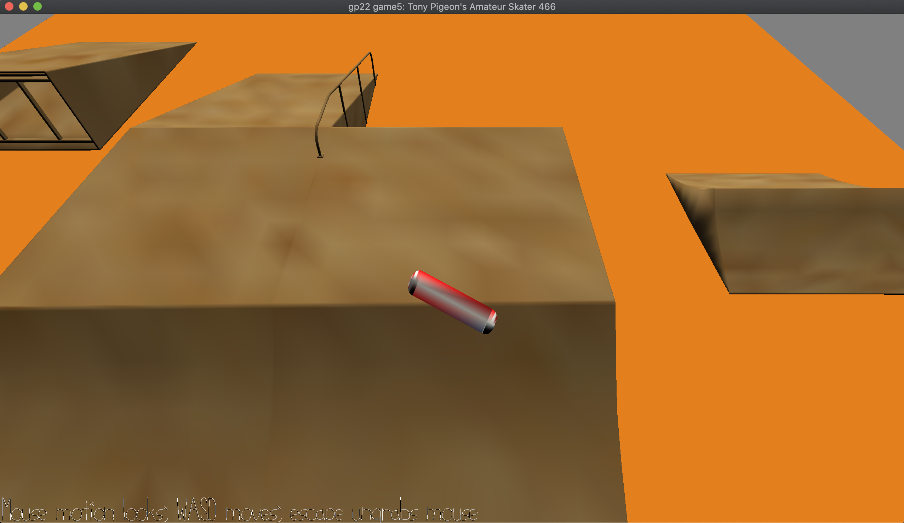

# Tony Pigeon's Amateur Skater 466

Author: Dakota Hernandez (dshernan)

Design: My game is a skateboarding game, the original idea made it high-stakes
by making the skate park be on top of a building so that if you fall, you *die*.
However, I didn't have time for nice set dressing or implementing death so it's
just a fun little game where you play as a skateboard and skate around my skate
park.

Screen Shot:

How To Play:

Use W to move forward, S to move backwards, and move your mouse left and right
to steer!

Each feature has some cool things about it:

- The center feature has a secret hiding spot in its back right corner.
- The left feature is a jump! Skate off of one of the ramps to pop up and land
  on the other ramp! You can also drive between the ramps :0
- The right feature is a cool "inverted halfpipe": drive up one side to pop
  way up before coming down on the other side!

What the game lacks in gameplay depth it makes up for in having a really cool
WalkMesh.

Sources:

- [Skateboard](https://www.turbosquid.com/3d-models/free-skateboard-skate-3d-model/641938)
- [Skate Ramps](https://www.turbosquid.com/Search/Index.cfm?include_artist=tornado%20studio&keyword=skate+ramp+fun+box&media_typeid=2)
- [Floor Material](https://polyhaven.com/a/laminate_floor)
- [Skateboard Sound 1](https://www.zapsplat.com/music/skateboard-roll-past-nobody-onboard-internal-1/)
- [Skateboard Sound 2](https://www.zapsplat.com/music/skateboard-roll-past-nobody-onboard-internal-2/)
- [Skateboard Sound 3](https://www.zapsplat.com/music/skateboard-roll-past-nobody-onboard-internal-3/)

I tried using blender's bake texture to vertex color feature but it didn't
really work how I wanted to -- not sure if there's a better way but the ramps
are *supposed* to be wood and the skateboard is *supposed* to be an American
flag.

This game was built with [NEST](NEST.md).

